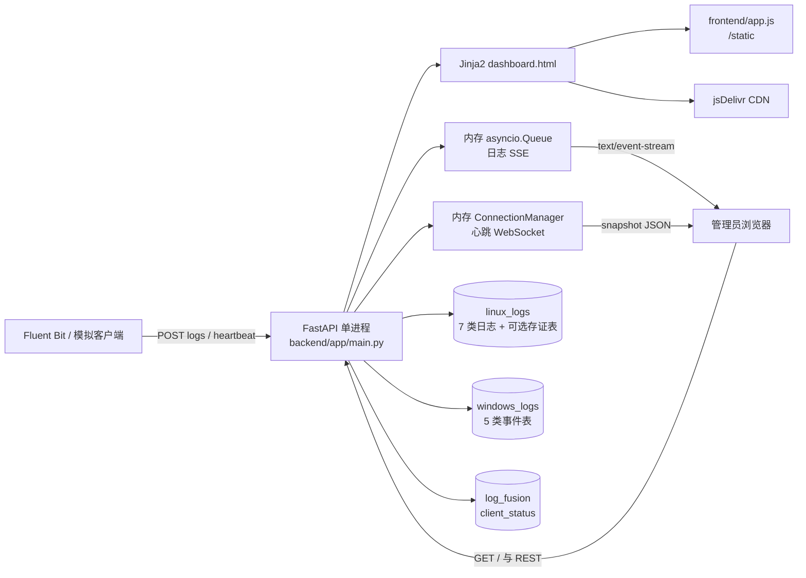
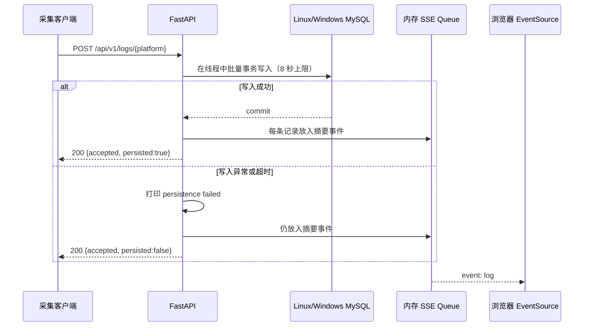
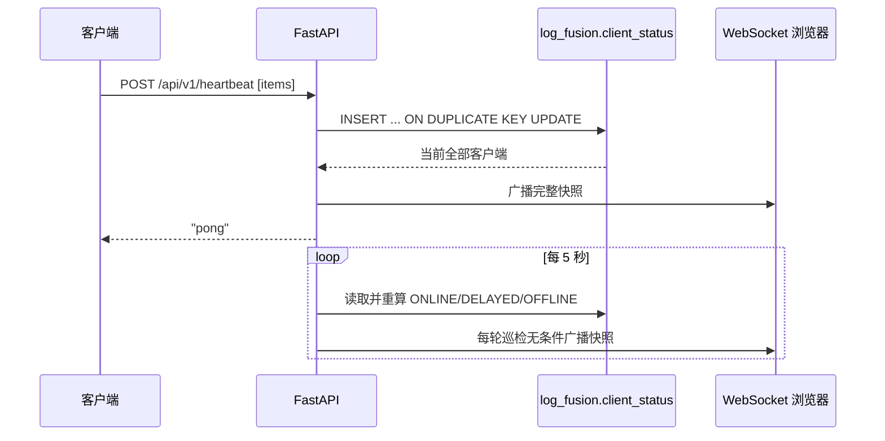

# 系统架构

> 基线日期：2026-10-10（同日按当前工作区代码复核）。架构描述来自当前 `backend/`、`frontend/` 和根启动脚本；旧 Spring Boot/Vue 工程仅作历史参考。

## 1. 架构概览

当前系统是单个 FastAPI 进程承载页面、API 与实时连接的三库应用。浏览器入口由 Jinja2 服务端渲染，页面再通过 HTTP、SSE 和 WebSocket 获取动态数据。Linux、Windows 日志沿用不同的历史表结构，客户端状态写入独立平台库。

## 2. 组件与职责

| 组件 | 职责 | 状态边界 |
|---|---|---|
| `backend/app/main.py` | FastAPI 应用、路由、静态资源禁缓存中间件、日志写入、心跳 upsert、SSE、生命周期巡检 | 应用主入口 |
| `backend/app/config.py` | 从环境和 `.env` 加载应用/数据库配置 | `get_settings()` 进程内缓存 |
| `backend/app/db.py` | 创建三个同步 SQLAlchemy Engine、监控库 Session、健康检查 | 每进程各自连接池 |
| `backend/app/models.py` | 声明 `ClientStatus` ORM 模型 | 仅覆盖平台心跳表 |
| `backend/app/catalog.py` | Linux/Windows 类别和 Linux 查询列 | 代码内静态元数据 |
| `backend/app/services.py` | 分类查询（列表上限 100 / 导出上限 10000）、汇总、跨库最近日志合并 | 同步 SQL |
| `backend/app/parsers.py` | 原始日志 → 数据库行的解析（Linux auditd/syslog、Windows winlog），时间与列类型归一化 | 纯函数，无状态 |
| `backend/app/ws.py` | 维护浏览器 WebSocket 集合并广播快照 | 进程内，不跨 worker |
| `dashboard.html` | 服务端页面骨架与四个功能区 | 根路由渲染 |
| `frontend/app.js` | Alpine 页面状态、REST 调用、心跳 WebSocket 连接/重连/假死检测、概览环形图（实例复用 + 尺寸自适应 + 图例/图形分列）、CSV 客户端导出 | 浏览器内存；图表布局由 `tools/chart-layout-check.cjs` 自检 |
| `启动服务.ps1` | 校验解释器、配置 PYTHONPATH、尝试开放防火墙、启动 Uvicorn | 默认 8080 |
| `backend/simulator/...` | 读取外部样例并发送心跳及两类日志 | 开发联调工具 |

`frontend/index.html` 与 `frontend/styles.css` 当前未被根路由使用；`/static` 挂载使它们可被直接访问，但不是现行页面入口。

## 3. 启动与生命周期

1. Uvicorn 导入 `app.main:app`，模块级创建三个 SQLAlchemy Engine、SSE 队列和 WebSocket 管理器。
2. FastAPI lifespan 启动时调用 `Base.metadata.create_all(monitor_engine)`；当前只会尝试创建 `log_fusion.client_status`。
3. 如果建表失败，应用记录异常但继续启动。
4. lifespan 创建 `_status_watchdog()` 后台任务，每 5 秒重算所有客户端状态：仅当状态变化时才提交数据库，但**每轮都无条件广播一次完整快照**（见 ADR-009）。
5. 服务停止时取消 watchdog。进程结束会清空 SSE 队列和 WebSocket 连接；`client_status` 数据保留在 MySQL。

根脚本默认以单 worker 启动。当前代码没有显式配置 worker 数，也没有跨进程共享的实时消息层。

## 4. 页面请求链路

### 4.1 首屏

1. 浏览器请求 `GET /`。
2. 后端调用 `summary()` 统计 12 张分类表；异常时首页上下文降级为全 0。
3. Jinja2 返回 `dashboard.html`。
4. 浏览器从 `/static/vendor/` 加载 Bootstrap、HTMX、Alpine.js 和 ECharts，从 `/static/app.js` 加载本地交互代码。
5. Alpine 初始化时请求日志汇总和类别，连接心跳 WebSocket（`/ws/client-monitor`）；WebSocket 断开时退化为每 5 秒轮询 REST，概览每 10 秒刷新，日志/存证页各自每 15 秒刷新。

### 4.2 局部与功能页

- HTMX 每 30 秒请求 `/partials/db-status`，返回三个数据库状态 badge 的 HTML 片段。
- 心跳页请求 `/api/v1/monitor/summary` 和 `/api/v1/monitor/clients`。
- 日志页按平台和类别请求 `/api/v1/logs/categories/{category}`。
- 存证页请求存证摘要和列表；数据库表不可用时当前后端返回空数据。
- 心跳页已接入 WebSocket：`app.js` 连接 `/ws/client-monitor`，用 `wsStatus` 显示“实时连接/连接中/已断开，重连中”，收到快照后直接更新指标与列表，WebSocket 未连接时回退到每 5 秒轮询 REST；断开后按指数退避重连（上限 30 秒），超过 20 秒未收到任何消息则主动关闭以触发重连。

## 5. 日志采集、持久化与实时通知

### 5.1 Linux 路径

解析在 `backend/app/parsers.py`（参考只读的 `旧后端/log-backend/src/main/python/linux/`）：

- 带 `normalized` 子对象的载荷优先使用其中字段；缺 `event_time` 时回退顶层 `timestamp`。
- 原始行先按 auditd 解析（`type=... msg=audit(...)`），按类型映射到 7 张表：`SYSCALL` 依 `syscall` 判定进程/文件类，`EXECVE`/`PROCTITLE` 归进程与命令，`SOCKADDR`/`NETFILTER_*` 归网络/IPC，`USER_AUTH`/`CRED_*` 归认证会话；未收录类型按解析失败上报。
- 非 auditd 的 syslog 行（`Oct  2 17:30:01 host proc[pid]: msg`）归入 `authentication_session`、`type=SYSLOG`，并从 `session opened/closed` 推出 operation、从 `for user X` / `for X from` 推出 account。
- 行字段按目标表真实列裁剪（`catalog.LINUX_TABLE_FIELDS`），被裁掉的非空字段并入 `tips`；`event_id` 用 sha256 生成稳定值（不再使用跨进程会变的 `hash()`）。
- 时间统一解析为 UTC `datetime`：ISO（含 `Z`/偏移）、`%Y-%m-%d %H:%M:%S %z`、epoch 秒/毫秒/微秒，以及无年份的 syslog 行首。

### 5.2 Windows 路径

- 兼容 Fluent Bit winlog JSON：`TimeGenerated`/`TimeWritten`/`date`、`EventID`、`RecordNumber`、`SourceName`、`ComputerName`、`Channel`、`Data`/`StringInserts`、`Message`、`Sid` 等。
- channel（忽略大小写与连字符）映射到 5 张 `{channel}_logs` 表；无法识别时写入 `application_logs`。
- `eventdata` 汇总 `Data`/`Message`/`EventType`/`EventCategory`/`Qualifiers`/`Sid`/`log_source`，其余未识别键进入 `system_extra`，两者均以 JSON 字符串写入。
- 时间统一转成 UTC `datetime` 写入 `time_created`（如 `2026-10-02 20:03:18 +0800` → `12:03:18`），`source_year` 取该时间年份。
- 整型列空值写 `NULL`（不是空字符串），字符串按列宽截断，避免 1366/1406 类错误。

### 5.3 SSE 语义与限制

- 新连接先收到 `connected` 事件。
- 有日志时收到 `log` 事件；20 秒无日志收到 `heartbeat` 事件。
- `event_queue` 最大 1000。生产者使用等待式 `put()`，队列满时采集请求可能阻塞。
- 所有 SSE 连接共享同一个消费队列，因此多个订阅者是竞争消费，不是广播；一条事件通常只会被其中一个连接取走。
- 队列不持久化，没有 `Last-Event-ID` 或断线补发实现。

## 6. 心跳数据流

状态阈值由最后心跳年龄决定：

- `<= 10` 秒：`ONLINE`
- `> 10` 且 `<= 30` 秒：`DELAYED`
- `> 30` 秒：`OFFLINE`

API 构造响应时会实时重算状态，watchdog 只用重算结果回写数据库（状态未变化时不产生 `UPDATE`）。WebSocket 连接首次建立后立即收到快照；之后每次成功心跳、以及 watchdog 每 5 秒的巡检轮次都会收到广播，因此空闲连接也能持续收到消息。

## 7. 查询与导出路径

- 分类汇总对 12 张表逐表执行 `COUNT(*)`，任一未捕获异常都可能使 API 失败。
- 分类列表按第一个选择列倒序，分页上限 100；关键词 SQL 按目标表实际存在的列构造（Linux 取 `hostname`/`source_address`/`type` 的交集，Windows 用 `computer`/`provider_name`/`event_id`）。
- 最近日志分别在 Linux 和 Windows 库内 UNION（Linux 缺列用 `NULL` 占位），再在 Python 合并；排序键统一转 ISO 字符串，避免两个库时间列类型不一致时比较失败。
- 日志 CSV 导出最多查询 10000 条（`size` 参数上限 10000，内部通过 `size_cap` 放宽，不受分类列表 100 行上限影响），在内存构造完整字符串后流式包装响应。
- 存证读取固定从 `linux_logs.audit_log_evidence` 取最近 1000 条，然后在 Python 中统计、筛选、分页或导出。

## 8. 状态与一致性边界

| 状态 | 存储 | 重启后 | 多 worker/多实例共享 |
|---|---|---|---|
| 分类日志 | MySQL | 保留 | 共享同一数据库时可见 |
| `client_status` | MySQL | 保留 | 共享，但广播连接不共享 |
| watchdog 任务 | 进程 | 重建 | 每 worker 独立运行，会重复巡检 |
| WebSocket 连接集合 | 进程内 set | 丢失 | 不共享 |
| SSE 日志队列 | 进程内 queue | 丢失 | 不共享 |
| 浏览器页面状态 | 浏览器内存 | 刷新丢失 | 不适用 |

因此当前部署约束是单 worker、单应用实例。即使心跳数据已持久化，多 worker 仍会造成 SSE 分流、WebSocket 广播不完整和重复 watchdog。

## 9. 外部依赖

- MySQL `linux_logs`、`windows_logs`、`log_fusion` 三个逻辑库。
- jsDelivr CDN 已不再是依赖：Bootstrap、HTMX、Alpine.js、ECharts 自托管在 `frontend/vendor/`（见 ADR-011）。
- Windows/Conda 固定解释器路径，见 `docs/README.md`。
- 模拟器依赖仓库外的 Linux/Windows 样例文件。
- 局域网访问依赖 Windows 防火墙规则和本机网络/代理配置。

## 10. 故障处理行为

| 场景 | 当前行为 |
|---|---|
| 首页汇总失败 | 吞掉异常，渲染全 0 汇总 |
| `/health` 某库不可用 | HTTP 200；对应数据库布尔值为 `false`，顶层仍为 `ok` |
| `client_status` 自动建表失败 | 记录异常并继续启动；心跳/监控接口之后可能 5xx/503 |
| 心跳写入失败 | 记录异常并返回 HTTP 503 `heartbeat persist failed` |
| 日志解析或入库失败 | HTTP 200，`persisted:false`，`errors[].stage` 区分 `parse`/`insert`，仍写入 SSE 队列 |
| 存证查询失败/表缺失 | 吞掉异常并返回空摘要、空列表或只有 BOM 的 CSV |
| 分类/汇总 SQL 失败 | 没有统一捕获，通常返回 HTTP 500 |
| WebSocket 单连接发送失败 | 记录警告并移除连接；单次发送上限 10 秒 |

## 11. 安全边界

当前代码没有登录、角色、API key、采集端签名、CORS 策略或速率限制。所有能够访问监听端口的主机都可能读取、导出或写入日志并建立实时连接。数据库 URL 由字符串拼接，代码内还有默认 root 凭据。

已有的有限防护：

- Linux/Windows 写入表从固定映射选择。
- 分类查询的 category 仅允许 ASCII 字母、数字和下划线（中文等非 ASCII 字符会被拒绝），参数值通过绑定变量传递。
- 查询分页有部分上限。

仍需注意：分类查询没有验证 category 必须属于 catalog，因而可尝试访问同库其他合法表名；CSV 没有公式注入防护；错误处理缺少统一的敏感信息审查。

## 12. 当前架构限制与技术债

1. 没有既有日志表与存证表的正式 DDL/迁移；只有 `client_status` ORM 模型。
2. 进程内实时状态阻止安全横向扩展。
3. SSE 仍是竞争队列而非广播，并存在背压阻塞风险（当前前端已不再订阅，影响面限于外部消费方）。
4. 分类关键词和最近日志查询曾假设所有 Linux 表都有同一批字段；2026-10-10 已按真实列适配（缺失列用 `NULL` 占位、关键词只搜存在的列），原 500 故障已消除。
5. 存证接口不写入、不校验，且把数据库错误降级为空数据；实测 `audit_log_evidence` 表不存在，接口必然返回空，无法与“没有存证”区分。
6. `monitor/clients/{client_id}/logs` 当前返回全局最近日志，没有按客户端过滤。
7. CSV 导出在内存一次性生成，且没有公式注入防护。
8. 采集失败已改为 `logger` + 逐条 `errors` 明细，但仍没有失败指标、重试或死信机制。
9. 没有自动化测试、结构化可观测性、认证授权或明确的生产部署拓扑。

具体建议和验收口径见 [TODO.md](./TODO.md)。
